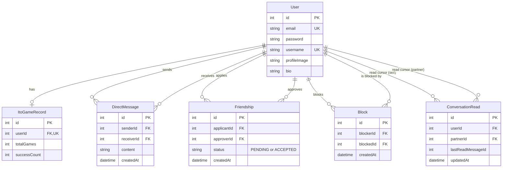

*This project has been created as part of the 42 curriculum by skimura, takawagu, squinn, tmura.*

# ito — a cooperative number-guessing party game, transcended

## Table of Contents

- [Description](#description)
- [Instructions](#instructions)
- [Resources](#resources)
- [Team Information](#team-information)
- [Project Management](#project-management)
- [Technical Stack](#technical-stack)
- [Database Schema](#database-schema)
- [Features List](#features-list)
- [Modules](#modules)
- [Individual Contributions](#individual-contributions)
- [Known Limitations](#known-limitations)

## Description

**ito** is our take on the `ft_transcendence` "Surprise" activity: we built a full web platform around **ito**, a cooperative party card game. Each player is secretly dealt a number from 1–100. Given a shared theme (e.g. "something scary, 1 = not scary at all, 100 = terrifying"), players describe their number in words — without saying the number itself — and the group must work out, through discussion, how to lay every card down in ascending order. One wrong guess and the round is lost.

On top of the game itself, the platform implements the account, social and real-time infrastructure required by the `ft_transcendence` subject: authentication, profiles, a friends system with live online status, blocking, direct messages, and a real-time multiplayer game engine with room management, turn ordering and disconnect/reconnect handling.

### Key features

- Email/password authentication with JWT sessions
- User profiles (username, bio, avatar, password) with live validation
- Friends system: send/accept/reject requests, remove, block, search
- Real-time online presence and friend-request notifications over WebSocket
- Direct messages between friends, with persisted unread counts and read cursors
- Multiplayer **ito** game rooms (2–6 players) with a full phase state machine (lobby → theme setup → dealing → prompt input → speaking/placement → ordering → reveal → results)
- Turn-based drag-and-drop card placement and reordering, live for every player in the room
- Host-driven pause/rejoin flow for player disconnects mid-game, with full state resync
- Per-user game history (games played / rounds won)
- HTTPS-only access behind an Nginx reverse proxy, fully containerized with Docker Compose

## Instructions

### Prerequisites

- Docker and Docker Compose (v2, the `docker compose` plugin)
- `make`
- Python 3 (only used by the `Makefile` to auto-detect your LAN IP so other devices on your network can reach the app; no external network calls are made)
- A locally trusted (self-signed) TLS certificate at `nginx/certs/fullchain.pem` / `nginx/certs/privkey.pem` (Nginx serves HTTPS only)

### Configuration

1. Copy the environment template, then fill in `POSTGRES_PASSWORD` and `JWT_SECRET` — both are required (no default) and the app won't start until they're set:
   ```bash
   cp .env.example .env
   ```
   ```bash
   # in .env
   POSTGRES_PASSWORD="$(openssl rand -base64 32)"
   JWT_SECRET="$(openssl rand -base64 48)"
   ```

2. Generate a self-signed TLS certificate for Nginx:
```bash
   mkdir -p nginx/certs
   openssl req -x509 -nodes -days 365 -newkey rsa:2048 \
     -keyout nginx/certs/privkey.pem \
     -out nginx/certs/fullchain.pem \
     -subj "/CN=localhost"
```

3. Relevant variables (see `.env.example`):
   - `POSTGRES_USER` / `POSTGRES_PASSWORD` / `POSTGRES_DB` — database credentials; `POSTGRES_PASSWORD` has no default and must be set (see step 1)
   - `JWT_SECRET` / `JWT_EXPIRES_IN` — auth token signing; `JWT_SECRET` has no default and must be set (see step 1)
   - `HTTP_PORT` / `HTTPS_PORT` — public ports exposed by Nginx (default `8080` / `8443`)
   - `FORTYTWO_CLIENT_ID` / `FORTYTWO_CLIENT_SECRET` / `FORTYTWO_CALLBACK_URL` — reserved for a future 42 OAuth integration; **not currently used** (see [Known Limitations](#known-limitations))

### Running the project

```bash
make        # equivalent to `make up`: builds and starts every service, waits until healthy
```

Once it's up, the Makefile prints the URL(s) to open:

- From this machine: `https://localhost/`
- From another device on the same network: `https://<your-LAN-IP>/`

(These assume the default `HTTPS_PORT=443`; if you changed it in `.env`, append `:<HTTPS_PORT>` to the URL.)

Because the certificate is self-signed, your browser will warn you on first visit — accept it (e.g. "Advanced → Continue") to proceed.

Other useful targets:

```bash
make logs      # follow logs for all services
make down      # stop and remove containers
make restart   # down + up
```

### Architecture at a glance

`nginx` terminates TLS and reverse-proxies to `frontend` (Next.js) and `backend` (NestJS), including WebSocket upgrades for Socket.IO. `backend` talks to `postgres` (via Prisma) and `redis`. On boot, the backend container runs `prisma migrate deploy` before starting, so the schema is always up to date.

## Resources

### References used

- [NestJS documentation](https://docs.nestjs.com/)
- [Prisma documentation](https://www.prisma.io/docs)
- [Next.js documentation](https://nextjs.org/docs)
- [Socket.IO documentation](https://socket.io/docs/v4/)
- [React documentation](https://react.dev/)
- [PostgreSQL documentation](https://www.postgresql.org/docs/)
- Rules of the physical card game *ITO* (Arclight Games) as the basis for our digital adaptation's game design
- The `ft_transcendence` subject PDF (`ft_transcendence.pdf`, at the repository root) for the module requirements this project is graded against

### How AI was used

We used **Claude (Claude Code)** during development, primarily for:

- Drafting and iterating on the requirement/design documents in [`docs/`](docs/) (e.g. `friend-requirements.md`, `dm-requirements.md`, `login-requirements.md`, `reconnect-design.md`) — working through edge cases, data-model trade-offs, and API surface decisions before implementation
- Debugging concurrency/state bugs in the real-time game logic (disconnect handling, turn-order edge cases — see `docs/disconnect-array-bugs.md`)
- Code review and refactoring suggestions on backend validation logic (e.g. the profile-update DTO/validation-pipe gap fixed per `docs/login-requirements.md` §3)
- Generating this `README.md` from the project's codebase, git history and team input

AI was not used to generate the game design or business logic wholesale; it was used as a pair-programming and technical-writing aid, with all resulting code and docs reviewed by the team before merging.

## Team Information

| Login | Role | Responsibilities |
|---|---|---|
| `takawagu` | Tech Lead / Backend Developer | Backend architecture (NestJS), authentication & JWT sessions, friends & direct-message systems, presence/WebSocket infrastructure, Docker/Nginx/deployment setup, disconnect & reconnect design |
| `skimura` | Frontend Developer | ito game frontend: room UI, drag-and-drop card placement and reordering, chat widget, board/player styling and UX polish |
| `squinn` | Backend / Database Developer | Initial Prisma installation, database schema design and setup |
| `tmura` | Product Owner / Project Manager | Requirements definition and backlog management, task prioritization, coordination between team members |

## Project Management

- **Task distribution**: work was split by feature area (auth, friends/DM, game engine/frontend, infrastructure) and tracked as **GitHub Issues**, with feature branches named after the issue number and topic (e.g. `37-フレンド機能`, `50-戦績表示`) and merged via pull requests into `master`.
- **Communication**: day-to-day coordination happened on **Discord**.
- **Documentation-driven workflow**: non-trivial features were first written up as a requirements/design doc under [`docs/`](docs/) (data model, API surface, open questions marked `status: 要検討`) before implementation, then updated to `status: 実装済み` once shipped and verified.

## Technical Stack

### Backend

- **[NestJS](https://nestjs.com/)** (Node.js/TypeScript) — chosen for its opinionated module/dependency-injection structure, which made it easier for multiple people to work on separate feature modules (`auth`, `friends`, `messages`, `presence`, `ito`) without stepping on each other
- **[Prisma ORM](https://www.prisma.io/)** — type-safe database access and migrations
- **[Socket.IO](https://socket.io/)** (`@nestjs/platform-socket.io`) — real-time communication for game state, presence and live notifications
- **JWT** (`jsonwebtoken`) + **bcrypt** (`bcryptjs`) — stateless authentication and password hashing
- **class-validator** / **class-transformer** — request DTO validation

### Frontend

- **[Next.js](https://nextjs.org/) 16 / [React](https://react.dev/) 19** — App Router, chosen for file-based routing and a modern React feature set
- **[Tailwind CSS](https://tailwindcss.com/)** — utility-first styling
- **socket.io-client** — real-time client for game/chat/presence
- **[Playwright](https://playwright.dev/)** — end-to-end testing

### Database

- **[PostgreSQL](https://www.postgresql.org/)** — relational data (users, friendships, blocks, messages, game records) with real foreign-key/unique constraints, which suited the relational nature of the friends/blocks/DM data model better than a document store
- **[Redis](https://redis.io/)** — provisioned alongside the stack for caching/session-adjacent use as the real-time features grow

### Infrastructure

- **Docker Compose** — orchestrates `postgres`, `redis`, `backend`, `frontend` and `nginx` as a single stack
- **Nginx** — TLS termination and reverse proxy, including WebSocket upgrade handling for Socket.IO

## Database Schema



- **`User`** — one row per account; central entity referenced by every other table.
- **`ItoGameRecord`** — one-to-one per-user aggregate of ito games played/won (used for a personal stats display).
- **`Friendship`** — one row per friend relationship (`PENDING`/`ACCEPTED`); rejection is modeled as row deletion rather than a status, so a rejected request can be re-sent cleanly.
- **`Block`** — directional block relation (A blocking B is a separate row from B blocking A); kept out of `Friendship` because it has different semantics (can exist without ever having been friends) and different directionality guarantees.
- **`DirectMessage`** — one row per message, indexed both directions (`sender, receiver, createdAt` and `receiver, sender, createdAt`) so a conversation thread can be fetched without a full-table scan either way.
- **`ConversationRead`** — one row per (user, partner) pair holding the id of the last message read, instead of a `readAt` column on every message; this turns "mark conversation as read" into a single upsert instead of a bulk update.

## Features List

| Feature | Description | Contributor(s) |
|---|---|---|
| Registration & login | Email/password signup and login, bcrypt-hashed, JWT issued on success | `takawagu` |
| Live username/email availability check | Debounced uniqueness check while typing, plus a server-side check on submit as a race-condition backstop | `takawagu` |
| Profile management | Edit username, bio, avatar and password, with validated limits on each field | `takawagu`, `squinn` |
| Friends system | Send/accept/reject/remove friend requests, partial-match user search | `takawagu` |
| Blocking | Block/unblock a user; blocking clears any existing friendship | `takawagu` |
| Online presence | Live online/offline status and friend-request notifications over a dedicated WebSocket namespace | `takawagu` |
| Direct messages | 1:1 chat between friends, message history, persisted unread counts, "mark as read" cursor, input length limit/counter | `takawagu` |
| ito game engine | Room lifecycle, phase state machine, card dealing, turn order, round scoring | `takawagu` (engine design and implementation throughout, incl. unit tests), `skimura` (gameplay tuning: round transitions, validation, scope changes) |
| ito game UI | Drag-and-drop card placement and reordering, in-room chat widget, board/player layout | `skimura` |
| Disconnect / reconnect handling | Host-controlled pause menu on disconnect (wait / exclude / abort), host handover if the room host drops, full state resync (hand, theme, chat, board, turn order) on rejoin | `takawagu`, `skimura` |
| Personal game stats | Per-user total games played and rounds won | `takawagu` |
| Database schema & migrations | Initial Prisma setup and schema design; later migrations (blocking, DM indexes, read cursors) | `squinn` (initial), `takawagu` (later migrations) |
| Multi-device LAN access | `Makefile` auto-detects the host's LAN IP so the app is reachable from other devices on the same network over HTTPS | `takawagu` |
| Requirements & planning docs | Design/requirements documents in `docs/` driving each feature before implementation | `tmura`, with technical detail filled in by `takawagu` and `skimura` |
| Privacy Policy & Terms of Service | Accessible pages (linked from the footer) covering data handling and terms of use | `squinn` |

## Modules

> Counted directly against the `ft_transcendence` subject's official module list (`en.subject.pdf` / `ft_transcendence.pdf`), based on what is actually implemented in the code. 14 points are required; this totals **19 points**, i.e. 5 points of margin if something doesn't validate during evaluation.

| # | Category | Module | Type | Pts | Notes |
|---|---|---|---|---|---|
| 1 | Web | Use a framework for both the frontend (Next.js/React) and backend (NestJS) | Major | 2 | Both a real frontend framework and a real backend framework are used, per the subject's definition of "framework." |
| 2 | Web | Implement real-time features using WebSockets | Major | 2 | Socket.IO powers the ito game state, the `/presence` namespace (online status, friend-request notifications) and DM delivery, with graceful connect/disconnect handling. |
| 3 | Web | Allow users to interact with other users (chat + profile + friends, bundled as one module) | Major | 2 | Basic 1:1 chat (DMs), a profile view (friend detail window / own profile), and a full friends system (add/remove/search) are all implemented. |
| 4 | Web | Use an ORM for the database | Minor | 1 | Prisma ORM for all database access and migrations. |
| 5 | User Management | Standard user management and authentication | Major | 2 | Profile editing, avatar with a default fallback, friends with live online status, and a profile page — see the caveat below. |
| 6 | User Management | Game statistics and match history | Minor | 1 | Per-user `ItoGameRecord` (games played / rounds won), displayed on the home page; requires a functional game, which ito provides. |
| 7 | Gaming and UX | A complete web-based game where users play against each other | Major | 2 | **ito**, a real-time card game with clear rules and win/loss conditions per round — card games are explicitly listed as a valid game type in the subject. |
| 8 | Gaming and UX | Remote players (separate computers, real-time, reconnection logic) | Major | 2 | LAN access via the `Makefile`'s IP auto-detection, plus a full disconnect/pause/rejoin/resync flow — see `docs/reconnect-design.md`. |
| 9 | Gaming and UX | Multiplayer game (more than two players) | Major | 2 | ito rooms support 3–6 simultaneous players (2 is the floor, not the cap), with synchronized turn order across all clients. |
| 10 | Gaming and UX | Advanced chat features | Minor | 1 | Builds on the basic chat from module 3: per-conversation read receipts (`ConversationRead` cursor, persisted in Postgres) with unread badge counts synced live across tabs/devices over the presence WebSocket channel (`PRESENCE_EVENTS.DM_READ`), plus input validation (trimming blank-only messages, remaining-character feedback). See `backend/src/messages/messages.service.ts`. |
| 11 | Devops | Backend as microservices | Major | 2 | The backend is decomposed into independently built/deployed containers — `postgres`, `redis`, `backend` (NestJS API + Socket.IO gateway), `frontend` (Next.js), and `nginx` (TLS termination / reverse proxy) — each with its own Dockerfile, communicating only over the internal `app-network`, orchestrated by `docker-compose.yml`. |

**Total: 19 points** (14 required + 5 bonus, pending full functional validation of every claimed module during evaluation).

### Considered but not claimed

- **Public API (Web, Major)** — the REST API has enough endpoints, but no API-key auth, rate limiting, or documentation exists, all three of which the module explicitly requires.
- **42 OAuth (User Management, Minor) and 2FA (User Management, Minor)** — deliberately descoped; see `docs/login-requirements.md` §1 and §5. The `.env` OAuth variables are reserved for a future implementation.
- **AI Opponent / LLM system interface (Artificial Intelligence)** — the ito game's per-player "image generation" step is currently a stub (a placeholder image after a simulated delay, see `stubGenerateImage` in `backend/src/ito/service/game.service.ts`), not a real AI integration, so no AI module is claimed.

## Individual Contributions

### `takawagu` — Tech Lead / Backend Developer

Set up the original project scaffolding and owns the ito game engine end to end (`backend/src/ito`: room lifecycle, phase state machine, card dealing, turn order, round scoring, and the accompanying unit tests), as well as the rest of the backend: authentication (registration, login, JWT, validation hardening), the friends and blocking system, the presence WebSocket namespace, and the direct-message system end to end (schema, API, unread/read-cursor logic). Also owns the Docker Compose / Nginx / Makefile deployment setup, including LAN-IP auto-detection and HTTPS termination, and led the design and implementation of the disconnect/reconnect flow (host-driven pause menu, host handover, full state resync).

**Challenges faced**: the initial disconnect handling removed a player from the room outright with no reconnect path, which meant a dropped connection could end a game outright — this was rebuilt into a pause/rejoin flow driven by the room host, with careful handling of edge cases like the host being the one who disconnects (see `docs/disconnect-array-bugs.md` and `docs/reconnect-design.md`). Also caught and fixed a validation-pipe gap on the profile-update endpoint where an untyped `@Body()` silently skipped DTO validation, allowing the registration password-length rule to be bypassed after account creation.

### `skimura` — Frontend Developer

Built the ito game's in-room frontend: drag-and-drop placement and reordering of cards on the board, the combined chat/history widget, and the overall board/player UI. Iterated on the game UI heavily to keep the real-time state (turns, card positions, phase transitions) visually clear as rules were refined.

**Challenges faced**: synchronizing drag-and-drop interactions across multiple connected clients in real time, keeping the UI consistent for a player who reconnects mid-round.

### `squinn` — Backend / Database Developer

Introduced Prisma into the backend and defined the initial database schema underpinning users, friendships and game records.

**Challenges faced**: establishing a schema flexible enough to support features (friends, blocking, messaging) that were designed incrementally after the initial schema landed.

### `tmura` — Product Owner / Project Manager

Drove requirements gathering and task prioritization, and coordinated the team's GitHub Issues backlog and Discord communication across the project's milestones.

**Challenges faced**: keeping scope decisions (e.g. what counts as in-scope for the DM and friends modules, what to explicitly descope) documented and consistent as multiple features were designed and built in parallel — reflected in the `status:` / scope markers throughout `docs/`.

## Known Limitations

- **AI-generated card images are stubbed.** The ito game's per-player "image generation" step currently returns a placeholder image after a simulated delay, rather than calling a real image-generation API — see `stubGenerateImage` in `backend/src/ito/service/game.service.ts`.
- **42 OAuth and Two-Factor Authentication are not implemented** (see [Modules](#modules)).
- **No read receipts** are shown to the other party in direct messages — only the local unread count/cursor is tracked (`docs/dm-requirements.md` §6).
- Group chat, message editing/deletion, and message attachments are out of scope for the DM system.
