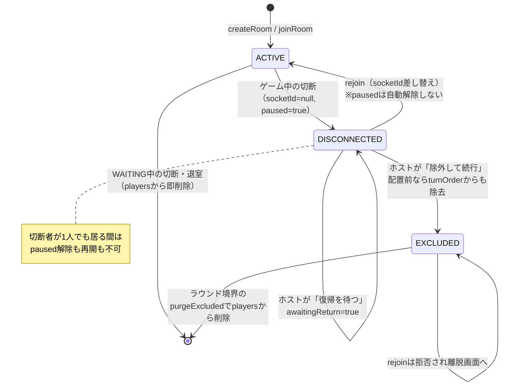

# ito 切断処理 / playerId 管理 — 構成まとめ

「切断・再接続でプレイヤー数と配列が変化する」経路の状態管理をまとめる。
2026-07-31のリファクタで、identityをplayerIdに一本化し、参加状態を単一のenumへ集約した。

対象ファイル:
- [backend/src/ito/ito.gateway.ts](../backend/src/ito/ito.gateway.ts)
- [backend/src/ito/service/room.service.ts](../backend/src/ito/service/room.service.ts)
- [backend/src/ito/service/game.service.ts](../backend/src/ito/service/game.service.ts)
- [backend/src/ito/service/room.store.ts](../backend/src/ito/service/room.store.ts)
- [backend/src/ito/service/player-utils.ts](../backend/src/ito/service/player-utils.ts)
- [backend/src/ito/service/broadcast.service.ts](../backend/src/ito/service/broadcast.service.ts)
- [backend/src/ito/types.ts](../backend/src/ito/types.ts) / [ito.events.ts](../backend/src/ito/ito.events.ts)
- [frontend/src/app/ito/room/[roomCode]/page.tsx](../frontend/src/app/ito/room/%5BroomCode%5D/page.tsx)
- [frontend/src/app/ito/room/[roomCode]/_phases/PauseOverlay.tsx](../frontend/src/app/ito/room/%5BroomCode%5D/_phases/PauseOverlay.tsx)

---

## 1. 2種類の識別子

| | 実体 | 寿命 | 用途 |
|---|---|---|---|
| `playerId` | DBの`userId`を文字列化 | ログインが続く限り不変 | **唯一のidentity**。turnOrder/boardOrder/roundHostId/messages 全てこれで参照する |
| `socketId` | Socket.ioのコネクションID | 接続が切れるたびに変わる | 「今どの接続に紐づいているか」だけを表す。切断中は`null` |

**`socketId`でプレイヤーを検索してはいけない。** 再接続で値が変わるため、検索キーとして使うと
「同じ人なのに別人扱い」「古い接続からのイベントが通ってしまう」といった不整合が起きる。

---

## 2. サーバ側の状態管理

### 2.1 `RoomStore` — socketIdからの唯一の入り口

```
socketToPlayer: Map<socketId, {roomId, playerId}>
roomCodeToId:   Map<roomCode, roomId>
rooms:          Map<roomId, ItoRoom>
```

全ハンドラは `store.resolve(client.id)` で `{room, player}` を1回で受け取る。
`resolve` は `player.socketId === socketId` の一致も検証するため、
**再接続で無効化された古いソケットからのイベントは自動的に解決に失敗して無視される**。

部屋を消す経路（切断で全員不在／退室で空／解散／中断／人数不足）では必ず
`unlinkRoomSockets(room)` を呼び、Mapにエントリが残らないようにしている。

### 2.2 `ItoPlayer` — 参加状態は単一のenum

```ts
type PlayerStatus = 'ACTIVE' | 'DISCONNECTED' | 'EXCLUDED';

interface ItoPlayer {
  socketId: string | null;  // 切断中はnull
  playerId: string;         // 不変のidentity
  status: PlayerStatus;
  awaitingReturn: boolean;  // ホストが「復帰を待つ」を選択済み（表示専用）
  ...
}
```

| status | 意味 | 集計対象 | ポーズ要因 |
|---|---|---|---|
| `ACTIVE` | 接続中 | ○ | — |
| `DISCONNECTED` | 切断中。席は保持 | ○（席がある） | ○ |
| `EXCLUDED` | ホストが除外済み | × | — |

### 2.3 守っている不変条件

| # | 不変条件 |
|---|---|
| I1 | `status === 'ACTIVE'` ⟺ `socketId !== null` |
| I2 | `status === 'EXCLUDED'` ⟹ `socketId === null`（除外対象はDISCONNECTEDのみ、rejoinはEXCLUDEDを拒否） |
| I3 | `awaitingReturn === true` ⟹ `status === 'DISCONNECTED'` |
| I4 | SPEAKING中は常に `currentTurnIndex === boardOrder.length` |
| I5 | `room.players` が縮むのは (a) WAITINGフェーズの退室/切断、(b) ラウンド境界の`purgeExcluded` のみ |
| I6 | 接続中0人になった部屋は即消さず `ROOM_DISPOSE_GRACE_MS` の猶予を持つ。猶予内に `linkSocket` が起きれば予約は取り消される。明示的な退室/解散/中断だけは猶予なしで即削除 |
| I7 | `ACTIVE` なプレイヤーが1人以上居る部屋には、必ず `ACTIVE` なホストが1人居る |

### 2.4 人数・状態判定は `player-utils.ts` に集約

`room.players.length` の直接参照や `status` の生の比較を散らかさないため、全てここを経由する。

| 関数 | 定義 | 用途 |
|---|---|---|
| `activePlayers` / `activeCount` | `status !== 'EXCLUDED'` | turnOrder構築、カード配布枚数、進捗の**分子と分母の両方** |
| `connectedPlayers` | `status === 'ACTIVE'` | 部屋の存続判定、ホスト移譲先 |
| `awolPlayers` | `status === 'DISCONNECTED'` | ポーズ継続条件、除外/復帰待ちの対象 |
| `purgeExcluded` | EXCLUDEDを`players`から除去（冪等） | `nextRound` と `startGame` の冒頭 |

進捗カウントは**分子と分母を必ず同じ集合から数える**こと。
片方だけ除外者を引くと、完了条件が永久に成立せずゲームが固まる。

---

## 3. 切断〜再接続のフロー

### 3.1 切断（`handleDisconnect`）

```
resolve(socketId) → {room, player}
unlinkSocket(socketId)

if roomPhase === 'WAITING':
    playersから即削除（保護すべきゲーム進行がまだ無い）
    空なら部屋ごと削除 / オーナーが抜けたら先頭へ移譲
    return

status = 'DISCONNECTED'、socketId = null
if connectedPlayers が0人 → 部屋ごと削除
if 抜けたのがオーナー → 接続中の人（居なければ未除外の人）へ移譲
if roomPhase !== 'GAME_OVER' → paused = true、GAME_PAUSED をbroadcast
```

**切断者は何人でも同時に扱える。** 誰が切断中かは `players[].status` が持つので、
2人目の切断で1人目の情報が上書きされることはない。

### 3.2 ホストの対応（切断者ごとに選択）

ポーズ中、ホストは切断者**1人ずつ**に対して選ぶ:

| 操作 | イベント | 挙動 |
|---|---|---|
| 復帰を待つ | `ito:awaitReturn {playerId}` | `awaitingReturn = true`。ポーズは続く |
| 除外して続行 | `ito:excludePlayer {playerId}` | `status = 'EXCLUDED'`。対象が`DISCONNECTED`でなければ拒否 |
| 中断して終了 | `ito:abortGame` | 部屋ごと削除 |

除外の内訳（分岐点は「カードが場に公開済みか」の一点のみ）:

- **配置前**（`boardOrder`に居ない）: `turnOrder`から除去し、`currentTurnIndex = boardOrder.length`（I4）。
  本人の手番でゲームが止まるのを防ぐ。
- **配置後**（`boardOrder`に居る）: `turnOrder`/`boardOrder`は**そのまま維持**。
  抜くと、まだ配置していない人が居るのに完了判定の分母がずれる。

いずれも `room.players` からは削除しない（I5）。ラウンド途中で消すと、
場に出ているカードの番号・名前・画像が失われて正解判定と結果画面が壊れる。

**ポーズが解除されるのは切断者が0人になったときだけ。**
除外しても他に切断者が残っていれば `paused` は`true`のまま。
`ito:resumeGame` も切断者が残っている間は拒否する。
（ホストは常に「除外」を選べるので、この制限で詰むことはない）

### 3.3 再接続（`ito:rejoin`）

```
roomCodeで部屋を引き、playerId一致でItoPlayerを検索
if status === 'EXCLUDED' → GAME_ABORTED を本人にだけ送って復帰させない
旧socketIdのリンクを外す（同一ページ内の自動再接続対策）
socketId = 新ID、status = 'ACTIVE'、awaitingReturn = false
RESYNC_STATE を本人にのみ個別送信 / PLAYER_RECONNECTED + ROOM_STATE を全員へ
```

`paused` はここでは**変更しない**。本人が戻ってもホストが明示的に再開を押すまで停止したまま。
一方、ホストがまだ何も選んでいない切断者や「復帰を待つ」を選ばれた切断者は**いつでも復帰できる**
（ページリロードは数秒で戻るため、ホストの操作を待たせない）。

### 3.4 状態同期の2系統

| イベント | 送信先 | 内容 |
|---|---|---|
| `ROOM_STATE` | 部屋全員 | `players`（status/awaitingReturn含む）・phase・turnPlayer・boardOrder・paused |
| `RESYNC_STATE` | 再接続した本人のみ | `ROOM_STATE` + `theme`/`turnOrder`全体/`messages`/`myCardNumber` |

`pausedPlayerId` のような「対象1人」フィールドは持たない。
フロントは `players.filter(p => p.status === 'DISCONNECTED')` で切断者一覧を導出する。

---

## 4. ラウンドをまたぐときの `players`

- `nextRound()` 冒頭で `purgeExcluded(room)` を呼び、除外済みプレイヤーを席ごと片付ける。
  結果表示は終わっているのでカード情報はもう不要。
- `startGame()` 冒頭でも同じ呼び出しを行う（`THEME_SETTING`中の除外は`nextRound`を通らないため）。
- `turnOrder` は `nextRound` で**意図的に残す**。`buildTurnOrder` が
  「前ラウンドの順を1つ回転させたもの」として次ラウンドの手番順を組み立てる回転元になるため、
  ここで空にすると次ラウンドの手番順が空になりゲームが進行不能になる。

---

## 5. `leaveRoom` は WAITING 専用

ゲーム進行中の離脱は `turnOrder`/`boardOrder`/`roundHostId` の再計算を伴うため、
`ito:leaveRoom` は `WAITING` 以外では拒否する。進行中に抜けた場合は
「切断 → ホストが除外」のフローに一本化されている。

---

## 6. ライフサイクル図



---

## 関連ドキュメント

- 設計意図・決定事項: [docs/reconnect-design.md](reconnect-design.md)
- 修正前に存在したバグの記録: [docs/disconnect-array-bugs.md](disconnect-array-bugs.md)
- ゲームルール: [docs/game-rule.md](game-rule.md)
